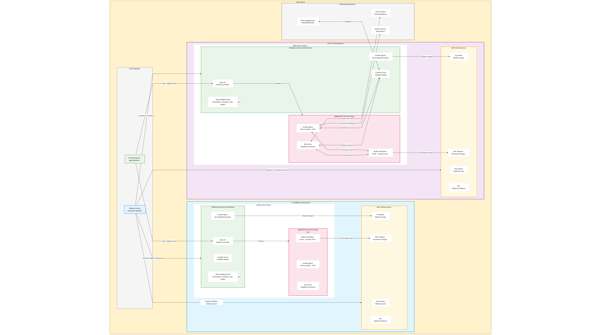

# Platform Architecture

## Overview

This document describes the architecture of the deployment platform, designed to run on **AWS EKS (multi-AZ, auto mode)** with separate **Sandbox** and **Live** environments. The solution ensures high availability, security, and a clear separation of infrastructure and application lifecycle management.

## Components

### 1. **Infrastructure (Terraform)**
- **EKS**: Multi-AZ, auto mode for scalability and resilience.
- **Networking**: Configured by Terraform (VPC, subnets, security groups).
- **Observability Stack**: Prometheus, Loki, Grafana.
- **LiveKit**: Deployed via Terraform using the official Helm chart with CPU-based autoscaling.
- **S3 (Egress Storage)**: Provisioned by Terraform for storing LiveKit egress outputs.
- **AWS ElastiCache**: Provisioned by Terraform for Redis caching service.
- **SIP Service**: Deployed via Terraform (Helm chart).
- **Agent Service**: Deployed via Terraform (Helm chart).
- **Base Chart**: Custom Helm chart for additional Kubernetes manifests (ingress, etc.).

### 2. **Helm Chart Management**

#### **Terraform-Managed Helm Charts**
- **LiveKit**: Official Helm chart with autoscaling configuration
- **Observability Stack**: Prometheus, Loki, Grafana, Jaeger
- **SIP Service**: Custom application Helm chart
- **Agent Service**: Custom application Helm chart  
- **Base Chart**: Custom Helm chart containing additional Kubernetes manifests
  - Ingress resources for applications etc

### 3. **Managed Services**
#### **AWS ElastiCache (Redis)**
- Managed Redis cluster for caching and session storage
- Multi-AZ deployment for high availability
- Automatic backup and maintenance managed by AWS
- CloudWatch integration for monitoring

### 4. **Observability Stack**
#### **Metrics Collection**
- **Prometheus**: Central metrics collection from all services
- **Grafana**: Visualization and alerting interface

#### **Logging**
- **Loki**: Centralized log aggregation and storage
- **Grafana**: Log exploration and correlation with metrics

### 5. **Autoscaling Strategy**
#### **LiveKit Workers**
- **Autoscaling Metric**: CPU utilization
- **Scale-up Threshold**: 0.5 CPU utilization
- **Load Threshold**: 0.7 CPU utilization (worker out-of-service)
- **Strategy**: Scale up at lower threshold than load_threshold to ensure service continuity
- **Benefit**: New workers added before existing ones go out of service

### 6. **Environment Separation**
- **Sandbox**: Used for testing and staging deployments.
- **Live**: Production-grade environment with the same deployment pattern.
- Both environments have isolated EKS clusters and infrastructure.

## Deployment Flow
1. **Terraform (via GitHub Actions)** provisions AWS resources and installs all components via Helm:
   - AWS infrastructure (EKS, VPC, S3, ElastiCache)
   - Observability stack (Prometheus, Loki, Grafana, Jaeger)
   - LiveKit with CPU-based autoscaling
   - Custom applications (SIP Service, Agent Service)
   - Base chart with additional Kubernetes manifests
2. **All services** are managed through Terraform Helm releases
3. **Observability** provides comprehensive monitoring across all deployed services
4. **LiveKit autoscaling** responds to CPU metrics to maintain service availability during variable traffic patterns

## Monitoring Integration

### Application Metrics
- **LiveKit**: Exposes metrics on port 6789, CPU utilization for autoscaling
- **Agent Service**: Custom AI performance metrics
- **SIP Server**: Expose metric for autoscaling 
- **Egress Service**:  Expose metric for autoscaling 

### Observability Flow
- All services expose metrics scraped by Prometheus
- Structured logs aggregated in Loki
- Distributed traces collected by Jaeger
- Unified visualization through Grafana dashboards
- All monitoring components deployed via Terraform Helm charts

## Future Enhancements
- Add Velero for Kubernetes-native backups to S3.
- Consider automated disaster recovery testing.
- Jaeger for Distributed tracing 
