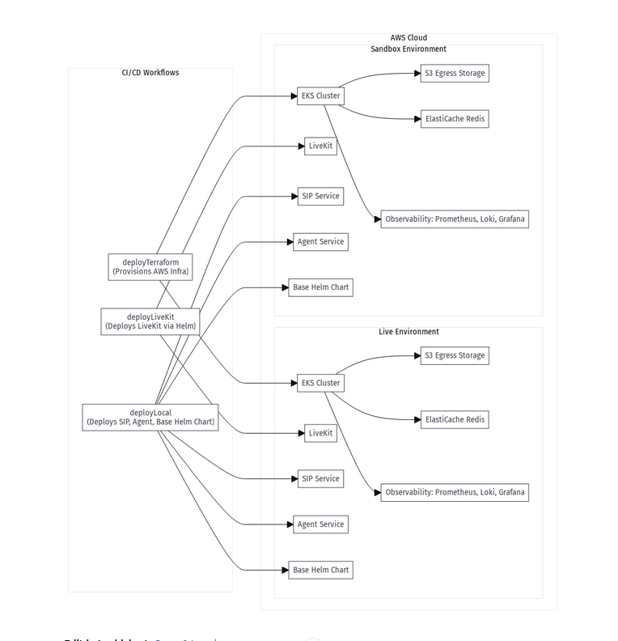

# Platform Architecture

## Overview

This document describes the architecture of the deployment platform, designed to run on **AWS EKS (multi-AZ, auto mode)** with separate **Sandbox** and **Live** environments. The solution ensures high availability, security, and a clear separation of infrastructure and application lifecycle management.


## Components

### 1. **Infrastructure (Terraform)**
- **EKS**: Multi-AZ, auto mode for scalability and resilience.
- **Networking**: Configured by Terraform (VPC, subnets, security groups).
- **Argo CD**: Bootstrapped by Terraform for GitOps-based workload management.
- **Observability Stack**: Prometheus, Loki, Grafana, Jaeger installed via Terraform (Helm charts).
- **LiveKit**: Deployed via Terraform using the official Helm chart.
- **S3 (Egress Storage)**: Provisioned by Terraform for storing LiveKit egress outputs.

---

### 2. **Workload Management**

#### **Argo CD**
- Installed and configured by Terraform.
- Manages the lifecycle of custom workloads via GitOps:
  - **Redis** (custom Helm chart)
  - **SIP Service** (custom Helm chart)
  - **Agent Service** (custom Helm chart)

#### **Terraform**
- Owns the lifecycle of:
  - AWS infrastructure
  - Argo CD installation
  - Observability stack deployment
  - LiveKit (Helm) release management

---

### 3. **Stateful Services**
#### **Redis**
- Deployed as a **StatefulSet** with **PersistentVolumeClaims** backed by AWS EBS.
- **RDB and AOF** persistence enabled for durability.
- Currently no external backup to S3—durability relies on PV and internal Redis persistence.

---

### 4. **Environment Separation**
- **Sandbox**: Used for testing and staging deployments.
- **Live**: Production-grade environment with the same deployment pattern.
- Both environments have isolated EKS clusters and infrastructure.

---

## Deployment Flow
1. **Terraform (via GitHub Actions)** provisions AWS resources and installs core platform components (EKS, Argo CD, Observability, LiveKit, S3 buckets).
2. **Argo CD** continuously monitors Git repositories and syncs custom workloads (Redis, SIP, Agent) into the cluster.
3. **Observability** is integrated with Prometheus, Loki, Grafana, and Jaeger, deployed as part of the platform stack.

---

## Future Enhancements
- Add Velero for Kubernetes-native backups to S3.
- Evaluate Redis HA (Sentinel) for improved availability.
- Consider automated disaster recovery testing.

```
