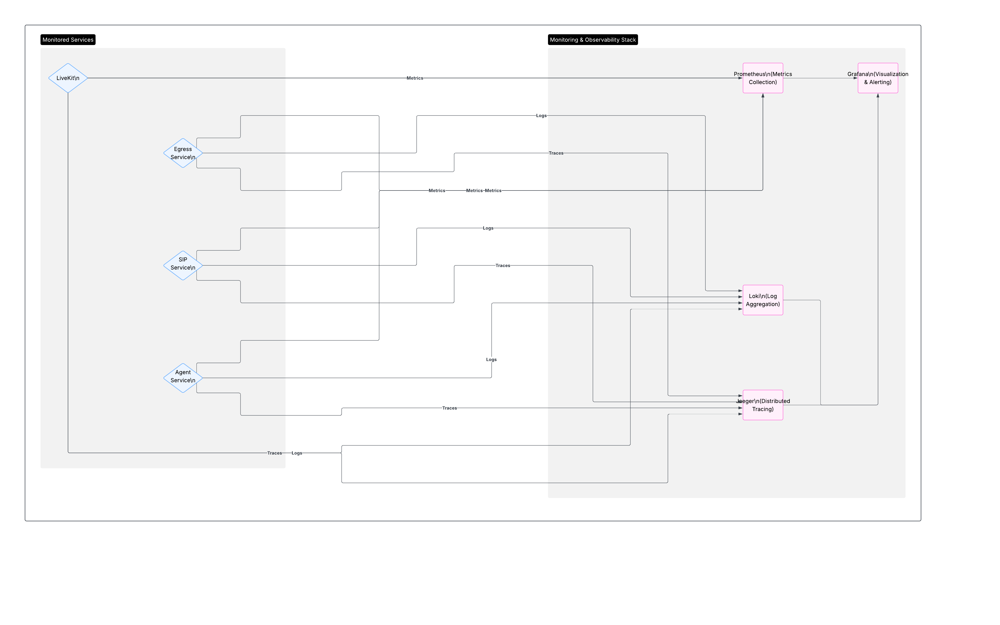

# LiveKit Monitoring Architecture

## Overview

This document describes the monitoring architecture for a LiveKit-based real-time communication platform running on Kubernetes. The architecture provides comprehensive observability across all components including metrics collection and centralized visualization.

## Architecture Components

### Core Services

**LiveKit Core Server**
- Main WebRTC media server handling real-time audio/video streams
- Exposes metrics on port 6789
- Configured with CPU-based autoscaling (scale up at 0.5 threshold, load_threshold at 0.7)

**SIP Server**
- Self-hosted SIP gateway for telephony integration
- Exposes application metrics for monitoring

**LiveKit Custom Agent**
- AI-powered conversational agents with voice/video capabilities
- Exposes custom metrics for AI model performance and processing times

**LiveKit Egress Service**
- Media export, recording, and live streaming
- Provides egress-specific metrics (livekit_egress_available)

### Monitoring Stack

**Prometheus**
- Central metrics collection and storage
- Scrapes metrics from all services
- Provides time-series database for historical analysis

**Grafana**
- Visualization and dashboards
- Real-time monitoring and alerting capabilities
- Custom dashboards for different operational views

**Loki**
- Centralized log aggregation
- Structured logging from all services
- Integration with Grafana for log visualization

## Data Flow

### Metrics Collection Flow
1. Prometheus scrapes metrics from multiple sources:
   - LiveKit Core Server (port 6789)
   - Custom Agent (application metrics)
   - SIP Server (application metrics for autoscaling)
   - Egress Service (livekit_egress_available for autoscaling)
   - Kubernetes metrics
2. All metrics stored in Prometheus time-series database
3. Grafana queries Prometheus for visualization and alerting

### Log Collection Flow
1. All services send structured logs to Loki
2. Loki aggregates and indexes logs
3. Grafana provides log exploration and correlation with metrics

## Key Metrics Monitored

### Application Metrics
- **LiveKit Core**: CPU utilization (autoscaling trigger), concurrent sessions, media quality
- **Custom Agent**: Processing times, AI model performance, active conversations
- **SIP Server**: Metrics for autoscaling
- **Egress Service**: Metrics for autoscaling

### Infrastructure Metrics
- **Kubernetes**: Pod health, resource utilization, scaling events
- **Storage**: S3 bucket usage for egress outputs

### Agent Autoscaling Metrics
- **CPU Utilization**: Primary metric for LiveKit Agent autoscaling
- **Scale-up Threshold**: 0.5 CPU utilization
- **Load Threshold**: 0.7 CPU utilization (worker out-of-service point)

## Benefits

### Comprehensive Observability
- End-to-end visibility from application layer to infrastructure
- Correlation between application performance and infrastructure health
- Real-time insights into service behavior

### Operational Excellence
- Proactive monitoring with customizable alerts
- Historical trend analysis for capacity planning
- Automated scaling based on load metrics

### Performance Optimization
- Distributed tracing identifies bottlenecks
- Log correlation assists with debugging
- Metrics-driven capacity planning

## Usage Notes

### Dashboard Access
- Grafana provides the primary monitoring interface
- Separate dashboards for metrics, logs, and traces
- Prometheus can be queried directly for custom analysis

### Alerting
- Configure alerts based on SLIs (Service Level Indicators)
- Monitor both application-specific and infrastructure metrics
- Set up escalation policies for different severity levels
- Critical: CPU utilization alerts for autoscaling validation

### Maintenance
- Regular cleanup of old metrics and log data
- Monitor Prometheus and Loki storage usage
- Keep Grafana dashboards updated with operational changes

## Integration Points

### Development Workflow
- Metrics help identify performance bottlenecks
- Distributed tracing assists with debugging request flows
- Historical data supports capacity planning decisions

### Autoscaling Integration
- CPU metrics drive LiveKit worker autoscaling
- Ensures service continuity during traffic spikes
- Prevents service degradation through proactive scaling

This monitoring architecture provides the foundation for maintaining high availability, performance, and security across the entire LiveKit communication platform.

