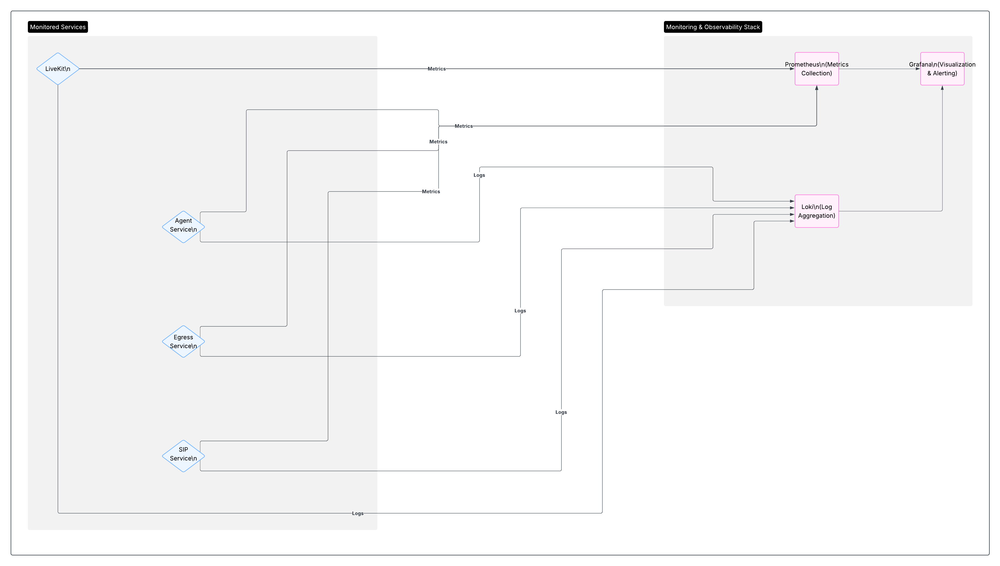

# LiveKit + Linkerd Monitoring Architecture
v
## Overview

This document describes the monitoring architecture for a LiveKit-based real-time communication platform running on Kubernetes with Linkerd service mesh integration. The architecture provides comprehensive observability across all components including metrics collection, service mesh monitoring, and centralized visualization.

## Architecture Components

### Core Services

**LiveKit Core Server**
- Main WebRTC media server handling real-time audio/video streams
- Exposes metrics on port 6789

**SIP Server**
- Self-hosted SIP gateway for telephony integration
  

**LiveKit Custom Agent**
- AI-powered conversational agents with voice/video capabilities

**LiveKit Egress Service**
- Media export, recording, and live streaming

**Redis Deployment**
- Distributed cache and session storage
- Redis Exporter provides detailed cache metrics on port 9121
- Critical for scaling and session management

### Service Mesh Layer

**Linkerd Control Plane**
- Provides service mesh management and control
- Linkerd Viz dashboard for real-time service mesh observability
- Generates comprehensive service-to-service communication metrics

**Linkerd Proxies (Sidecars)**
- Automatically injected into all application pods
- Collect detailed traffic, latency, and error rate metrics
- Provide mTLS encryption and traffic management

### Monitoring Stack

**Prometheus**
- Central metrics collection and storage
- Scrapes metrics from all services and proxies
- Provides time-series database for historical analysis

**Grafana**
- Visualization and dashboards
- Real-time monitoring and alerting capabilities
- Custom dashboards for different operational views

## Data Flow

### Traffic Flow
1. External clients connect through Linkerd proxies
2. Service mesh handles load balancing, encryption, and routing
3. Each service processes requests and generates application metrics
4. Proxy sidecars capture all network-level metrics

### Metrics Collection Flow
1. Prometheus scrapes metrics from multiple sources:
   - Application services (Agent, Egress)
   - Infrastructure (Redis Exporter)
   - Service mesh (Linkerd Control Plane and all proxies)
2. All metrics are stored in Prometheus time-series database (Integration with thanos object storage can be later added)
3. Grafana queries Prometheus for visualization and alerting

## Key Metrics Monitored

### Application Metrics
- **Custom Agent**: Processing times, AI model performance (Ask in the agent deployed)
- **Egress Service**: livekit_egress_available

### Infrastructure Metrics
- **Redis**: Cache hit rates, memory usage, connection counts
- **Kubernetes**: Pod health, resource utilization, scaling events

### Service Mesh Metrics
- **Traffic**: Request rates, response times, error rates
- **Security**: mTLS certificate status, authentication metrics
- **Reliability**: Circuit breaker status, retry rates, timeout rates

## Benefits

### Comprehensive Observability
- End-to-end visibility from application layer to network layer
- Correlation between application performance and infrastructure health
- Real-time insights into service mesh behavior

### Operational Excellence
- Proactive monitoring with customizable alerts
- Historical trend analysis for capacity planning

### Security Monitoring
- mTLS certificate management and rotation tracking
- Network policy compliance monitoring
- Service-to-service communication audit trail

## Usage Notes

### Dashboard Access
- Grafana provides the primary monitoring interface
- Linkerd Viz offers service mesh specific visualizations
- Prometheus can be queried directly for custom analysis

### Alerting
- Configure alerts based on SLIs (Service Level Indicators)
- Monitor both application-specific and infrastructure metrics
- Set up escalation policies for different severity levels

### Maintenance
- Regular cleanup of old metrics data
- Monitor Prometheus storage usage
- Keep Grafana dashboards updated with operational changes

## Integration Points

### Development Workflow
- Metrics help identify performance bottlenecks
- Service mesh data assists with debugging connectivity issues
- Historical data supports capacity planning decisions

This monitoring architecture provides the foundation for maintaining high availability, performance, and security across the entire LiveKit communication platform.